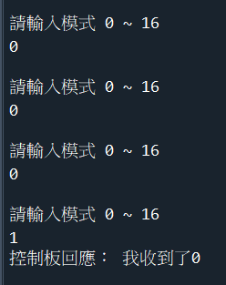

# Arduino
Using Arduino to control motor

# Arduino 數據類型轉換

● itoa()：將整型值轉換爲字符串。

● ltoa()：將長整型值轉換爲字符串。

● ultoa()：將無符號長整型值轉換爲字符串。

● gcvt()：將浮點型數轉換爲字符串，取四捨五入。

● ecvt()：將雙精度浮點型值轉換爲字符串，轉換結果中不包含十進制小數點。

● fcvt()：指定位數爲轉換精度，其餘同ecvt()。

● atof()：將字符串轉換爲雙精度浮點型值。

● atoi()：將字符串轉換爲整型值。

● atol()：將字符串轉換爲長整型值。

● strtod()：將字符串轉換爲雙精度浮點型值，並報告不能被轉換的所有剩餘數字。

● strtol()：將字符串轉換爲長整值，並報告不能被轉換的所有剩餘數字。

● strtoul()：將字符串轉換爲無符號長整型值，並報告不能被轉換的所有剩餘數字。


- 目前無法使用APO.h (APO.h/APO.cpp 的attach部分看起來有問題)
- 也可省略使用APO.h，於switch部分改成下方寫法

```arduino
void moto(byte DIR, int PWMA, int PWMB)
{
   switch (DIR)
	{
	case 0:
		RCL.write(70);
		RCR.write(70);
	case 1:
		RCL.write(0);
		RCR.write(30);
	}
}
```




# Arduino  DM542 motor control 接法


```
int pulPin = 10;  //pulse/clock/脈波
int dirPin = 11;  // 方向
int enblPin = 12;  //制能或是使用
```

# 參考資料
https://www.youtube.com/watch?v=x5L7B64f46o&t=436s&ab_channel=YangEugene

https://www.youtube.com/watch?v=SeqlgZLqI-k&ab_channel=MakerTutor